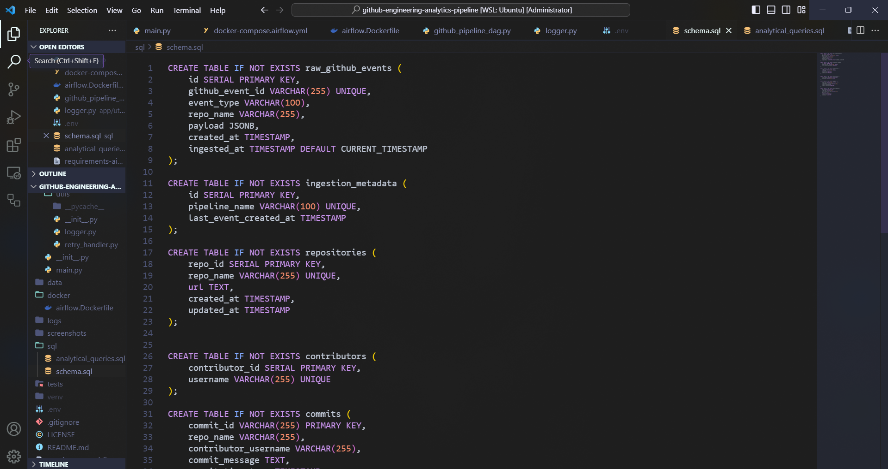
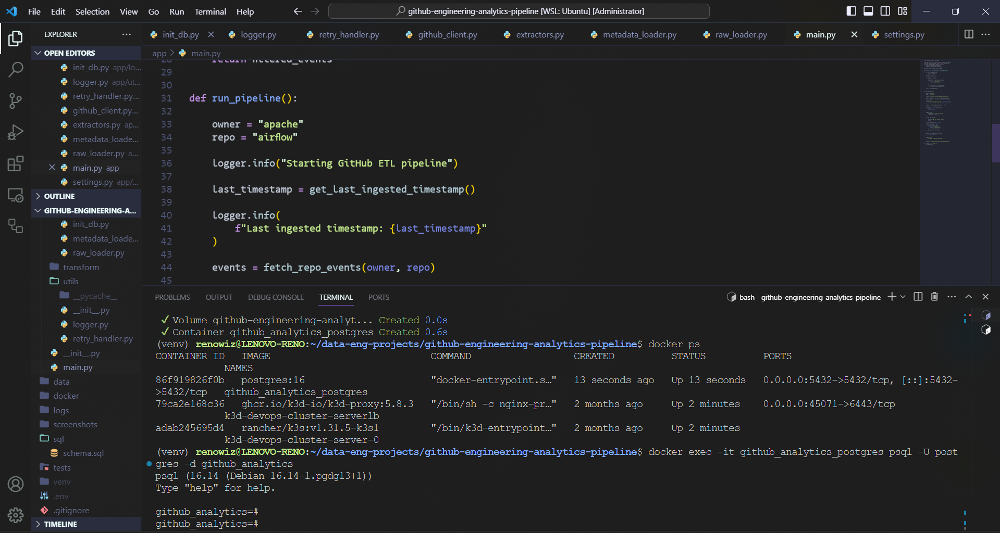
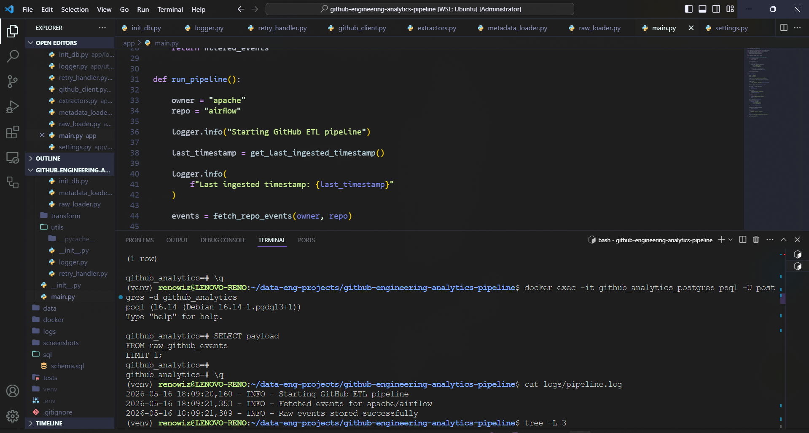
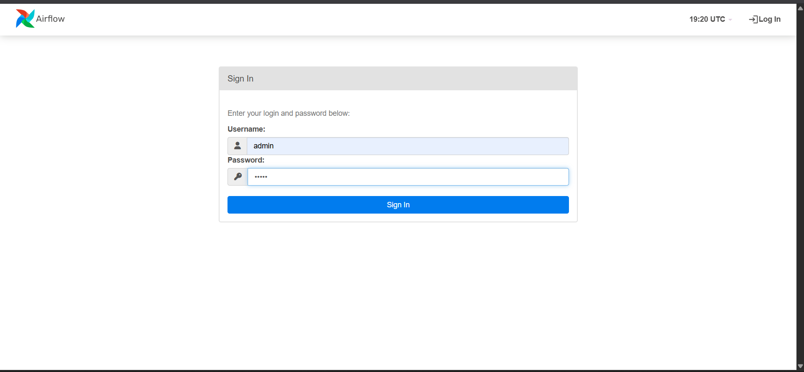
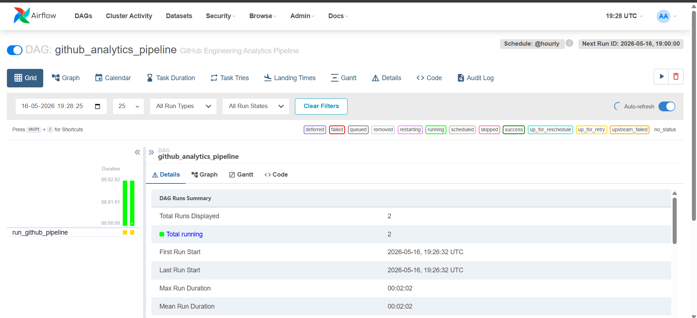
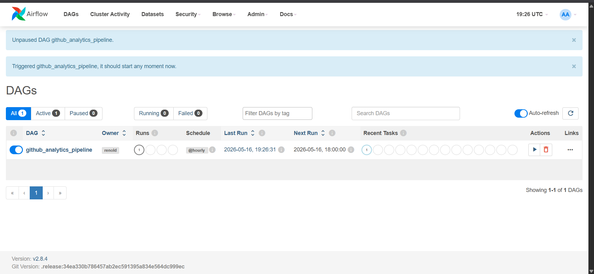

# GitHub Engineering Analytics Pipeline 🚀

## Overview

The **GitHub Engineering Analytics Pipeline** is a production-style Data Engineering project designed to ingest, process, transform, and orchestrate GitHub repository event data using a modern cloud-native data stack.

This project demonstrates:

* End-to-end ETL pipeline engineering
* Incremental and idempotent ingestion
* Dockerized infrastructure
* PostgreSQL-based warehouse architecture
* Airflow orchestration
* Transformation pipelines for analytics-ready data
* Production-oriented engineering practices

The pipeline fetches GitHub repository activity data using the GitHub REST API, stores raw JSON events inside PostgreSQL, transforms them into normalized analytical tables, and orchestrates execution using Apache Airflow.

---

# Architecture 🏗️

```text
                    +----------------------+
                    |    GitHub REST API   |
                    +----------+-----------+
                               |
                               v
                    +----------------------+
                    |   Extract Layer      |
                    |  (Python Requests)   |
                    +----------+-----------+
                               |
                               v
                    +----------------------+
                    |   Raw Data Layer     |
                    | PostgreSQL JSONB     |
                    +----------+-----------+
                               |
                               v
                    +----------------------+
                    | Transformation Layer |
                    |  Python ETL Models   |
                    +----------+-----------+
                               |
                               v
                    +----------------------+
                    | Processed Warehouse  |
                    | Normalized Tables    |
                    +----------+-----------+
                               |
                               v
                    +----------------------+
                    | Apache Airflow DAG   |
                    | Orchestration Layer  |
                    +----------------------+
```

---

# Key Features ✨

## Data Engineering Features

* GitHub API ingestion
* Incremental loading
* Pagination handling
* Retry mechanism for API failures
* Idempotent event loading
* Metadata-driven ingestion tracking
* JSONB raw storage
* Structured transformation pipeline
* Warehouse-style normalized schema

## Infrastructure Features

* Dockerized PostgreSQL
* Dockerized Airflow orchestration
* Python virtual environment setup
* Modular project architecture
* Environment variable management
* Logging integration
* Containerized execution workflows

## Orchestration Features

* Apache Airflow DAG scheduling
* Retry policies
* Task execution monitoring
* Workflow automation
* DAG-based orchestration

---

# Technology Stack 🛠️

| Category               | Technology      |
| ---------------------- | --------------- |
| Programming Language   | Python 3.12     |
| Database               | PostgreSQL      |
| Orchestration          | Apache Airflow  |
| Containerization       | Docker          |
| ORM                    | SQLAlchemy      |
| API Integration        | GitHub REST API |
| Environment Management | python-dotenv   |
| Retry Handling         | Tenacity        |
| Logging                | Python logging  |
| Package Management     | pip             |
| Workflow Scheduling    | Airflow DAGs    |

---

# Project Structure 📂

```text
github-engineering-analytics-pipeline/
│
├── airflow/
│   ├── dags/
│   │   └── github_pipeline_dag.py
│   ├── logs/
│   └── plugins/
│
├── app/
│   ├── config/
│   ├── extract/
│   │   ├── extractors.py
│   │   └── github_client.py
│   │
│   ├── load/
│   │   ├── init_db.py
│   │   ├── metadata_loader.py
│   │   ├── processed_loader.py
│   │   ├── raw_loader.py
│   │   └── raw_reader.py
│   │
│   ├── transform/
│   │   └── github_transformer.py
│   │
│   ├── utils/
│   │   ├── logger.py
│   │   └── retry_handler.py
│   │
│   └── main.py
│
├── docker/
│   └── airflow.Dockerfile
│
├── logs/
├── screenshots/
├── sql/
│   ├── analytical_queries.sql
│   └── schema.sql
│
├── .env
├── docker-compose.yml
├── docker-compose.airflow.yml
├── requirements.txt
├── requirements-airflow.txt
└── README.md
```

---

# Data Pipeline Flow 🔄

## Step 1 — Extract

The pipeline fetches GitHub repository event data using the GitHub REST API.

### Data Extracted

* Push events
* Pull request events
* Repository metadata
* Contributor activity
* Event timestamps
* Commit messages

---

## Step 2 — Raw Data Layer

Raw GitHub events are stored in PostgreSQL using the JSONB datatype.

### Benefits of JSONB Storage

* Flexible schema handling
* Full raw event retention
* Replayable transformations
* Semi-structured analytics support

---

## Step 3 — Incremental Ingestion

The pipeline tracks previously ingested timestamps using a metadata table.

### Benefits

* Prevents duplicate ingestion
* Supports incremental processing
* Reduces API usage
* Enables stateful execution

---

## Step 4 — Transformation Layer

Raw events are transformed into analytics-ready warehouse tables.

### Transformation Models

* repositories
* contributors
* commits
* pull_requests

---

## Step 5 — Processed Warehouse Layer

Normalized tables are loaded into PostgreSQL.

### Analytics Use Cases

* Contributor activity analysis
* Commit trend analysis
* Pull request analysis
* Repository engagement analytics

---

## Step 6 — Orchestration

Apache Airflow orchestrates scheduled pipeline execution.

### Airflow Responsibilities

* Scheduling
* Task retries
* DAG orchestration
* Workflow automation
* Execution monitoring

---

# Database Schema 🗄️

## Raw Layer

### raw_github_events

| Column          | Type      |
| --------------- | --------- |
| id              | SERIAL    |
| github_event_id | VARCHAR   |
| event_type      | VARCHAR   |
| repo_name       | VARCHAR   |
| payload         | JSONB     |
| created_at      | TIMESTAMP |
| ingested_at     | TIMESTAMP |

---

## Metadata Layer

### ingestion_metadata

| Column                | Type      |
| --------------------- | --------- |
| id                    | SERIAL    |
| pipeline_name         | VARCHAR   |
| last_event_created_at | TIMESTAMP |

---

## Processed Layer

### repositories

| Column    | Type    |
| --------- | ------- |
| repo_id   | SERIAL  |
| repo_name | VARCHAR |
| url       | TEXT    |

---

### contributors

| Column         | Type    |
| -------------- | ------- |
| contributor_id | SERIAL  |
| username       | VARCHAR |

---

### commits

| Column               | Type      |
| -------------------- | --------- |
| commit_id            | VARCHAR   |
| repo_name            | VARCHAR   |
| contributor_username | VARCHAR   |
| commit_message       | TEXT      |
| commit_timestamp     | TIMESTAMP |

---

### pull_requests

| Column               | Type      |
| -------------------- | --------- |
| pr_id                | BIGINT    |
| repo_name            | VARCHAR   |
| contributor_username | VARCHAR   |
| pr_title             | TEXT      |
| state                | VARCHAR   |
| created_at           | TIMESTAMP |
| closed_at            | TIMESTAMP |

---

# Setup Instructions ⚙️

## Prerequisites

Install:

* Python 3.12+
* Docker
* Docker Compose
* Git
* PostgreSQL client tools (optional)

---

# Clone Repository

```bash
git clone <repository_url>
cd github-engineering-analytics-pipeline
```

---

# Create Virtual Environment

```bash
python -m venv venv
source venv/bin/activate
```

---

# Install Dependencies

```bash
pip install -r requirements.txt
```

---

# Configure Environment Variables

Create:

```text
.env
```

Add:

```env
GITHUB_TOKEN=your_github_token

POSTGRES_USER=postgres
POSTGRES_PASSWORD=postgres
POSTGRES_DB=github_analytics
POSTGRES_HOST=localhost
POSTGRES_PORT=5432
```

---

# Start PostgreSQL

```bash
docker compose up -d
```

---

# Initialize Database Schema

```bash
python -m app.load.init_db
```

---

# Run Pipeline

```bash
python -m app.main
```

---

# Airflow Setup 🌪️

## Build Airflow Environment

```bash
docker compose -f docker-compose.airflow.yml up --build -d
```

---

## Initialize Airflow Database

```bash
docker compose -f docker-compose.airflow.yml run airflow-webserver airflow db migrate
```

---

## Create Airflow Admin User

```bash
docker compose -f docker-compose.airflow.yml run airflow-webserver airflow users create \
  --username admin \
  --firstname admin \
  --lastname admin \
  --role Admin \
  --email admin@example.com \
  --password admin
```

---

## Start Airflow Services

```bash
docker compose -f docker-compose.airflow.yml up -d
```

---

## Access Airflow UI

```text
http://localhost:8090
```

Credentials:

```text
Username: admin
Password: admin
```

---

# Sample Analytical Queries 📊

## Most Active Contributors

```sql
SELECT
    contributor_username,
    COUNT(*) AS total_commits
FROM commits
GROUP BY contributor_username
ORDER BY total_commits DESC
LIMIT 10;
```

---

## Most Active Repositories

```sql
SELECT
    repo_name,
    COUNT(*) AS total_events
FROM raw_github_events
GROUP BY repo_name
ORDER BY total_events DESC;
```

---

## Pull Request State Distribution

```sql
SELECT
    state,
    COUNT(*) AS total_prs
FROM pull_requests
GROUP BY state;
```

---

# Engineering Concepts Demonstrated 🧠

## Data Engineering

* ETL pipelines
* Incremental loading
* Idempotent ingestion
* Data warehousing
* Raw vs processed data layers
* Transformation modeling
* Metadata-driven pipelines

---

## DevOps & Infrastructure

* Docker containerization
* Service orchestration
* Infrastructure debugging
* Dependency isolation
* Container networking
* Environment management

---

## Workflow Orchestration

* Airflow DAGs
* Scheduling
* Retry policies
* Task execution
* Workflow monitoring
* Pipeline automation

---

# Challenges Faced ⚠️

During development, several real-world infrastructure and orchestration challenges were encountered and resolved.

## Key Engineering Challenges

* Airflow dependency conflicts
* SQLAlchemy compatibility issues
* Docker networking behavior
* Container permission management
* Airflow orchestration debugging
* Python module resolution
* Containerized environment isolation

These issues provided hands-on experience with production-style infrastructure troubleshooting.

---

# Known Infrastructure Limitation ⚠️

When executed inside Airflow containers, the pipeline may require container-to-host PostgreSQL networking adjustments depending on the local Docker or WSL environment configuration.

The ETL pipeline itself executes successfully in the local environment, and Airflow orchestration is fully configured.

---

# Future Improvements 🚀

## Planned Enhancements

* dbt integration
* Star schema warehouse modeling
* Kafka streaming ingestion
* AWS/GCP deployment
* Data quality testing
* CI/CD integration
* Grafana/Metabase dashboards
* Kubernetes deployment
* Prometheus monitoring
* Great Expectations validation

---

# Screenshots 📸









## Recommended Screenshots

Add screenshots for:

* Airflow DAG UI
* PostgreSQL tables
* Successful pipeline execution
* Docker containers
* DAG execution logs
* Architecture diagram

Store screenshots inside:

```text
screenshots/
```

---

# Resume Value 🎯

This project demonstrates practical skills relevant for:

* Data Engineering Internships
* Junior Data Engineer roles
* Analytics Engineering roles
* DataOps roles
* Platform Engineering internships

---

# Skills Demonstrated 📌

* Python
* SQL
* PostgreSQL
* Apache Airflow
* Docker
* SQLAlchemy
* ETL Development
* Data Warehousing
* API Engineering
* Workflow Automation
* Infrastructure Debugging
* Data Modeling

---

# Learning Outcomes 📚

This project provided hands-on experience with:

* Building production-style ETL pipelines
* Designing layered data architectures
* Implementing orchestration workflows
* Managing Dockerized infrastructure
* Debugging Airflow runtime issues
* Handling incremental ingestion logic
* Building analytics-ready warehouse layers

---

# Author 👨‍💻

Renold

M.Tech Computer Science

Focused on:

* Data Engineering
* Cloud Infrastructure
* DevOps
* Analytics Engineering
* Data Platforms

---

# License 📄

This project is intended for educational, learning, and portfolio purposes.
